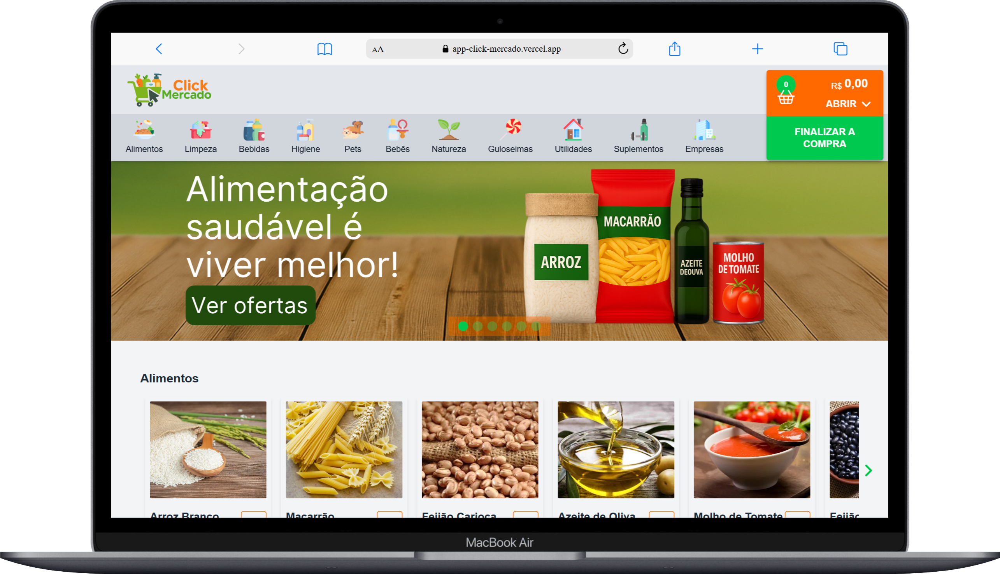
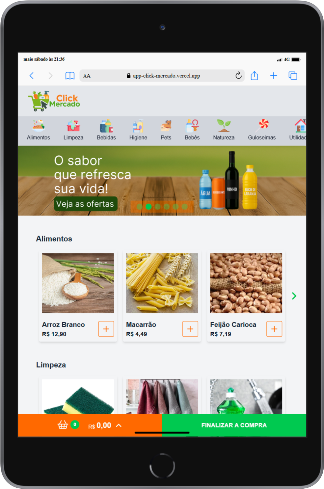
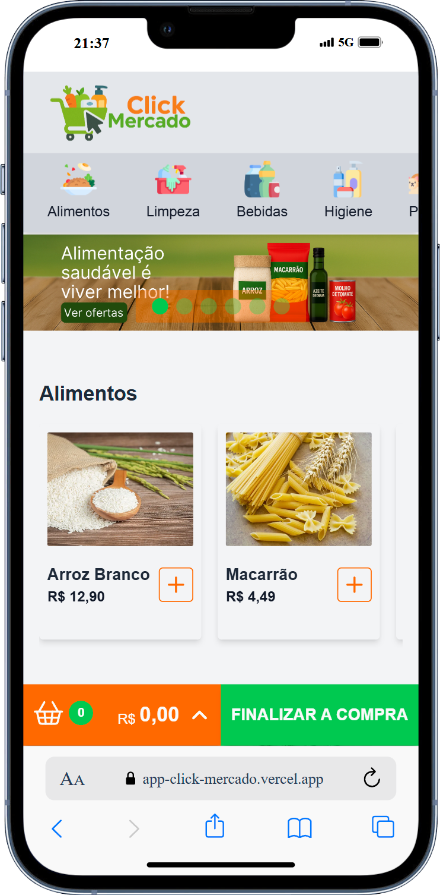

# App - Click Mercado

## Descrição
Este projeto foi desenvolvido para aprimorar minhas habilidades como desenvolvedor fullstack, colocando em prática conceitos e tecnologias que domino.

## O que é o Click Mercado?
É um projeto pessoal fictício de um mercado, desenvolvido com React, Tailwind CSS e boas práticas de código.
Cada funcionalidade foi pensada para ser simples, útil e didática.

## Objetivos:
- Mostrar minhas habilidades técnicas com React, componentização, hooks, rotas, estilização com Tailwind CSS, e mais.
- Aplicar princípios de Clean Code, organização de pastas, e manutenção de estados com clareza.
- Ajudar iniciantes com códigos simples, legíveis e prontos para estudo.
- Apresentar meu estilo de trabalho para recrutadores e empresas de tecnologia.

## Funcionalidades
- [x] Navegação intuitiva por categorias de produtos, facilitando a busca por itens. (Em desenvolvimento, integração de produtos nas demais categorias ainda pendente.)
- [x] Resumo dinâmico dos itens adicionados à cesta, com exibição da quantidade de produtos e cálculo automático do valor total da compra.
- [x] Layout responsivo para Desktop, Tablet e Mobile.
- [x] Seção visual destacada com banners de propaganda, apresentando os produtos.

## Tecnologias Utilizadas
- HTML: Linguagem de marcação para estruturação do conteúdo da web.
- CSS: Linguagem de estilo para o conteúdo da web.
- TailwindCSS: Framework utilitário para estilização rápida e responsiva.
- JavaScript (ES6+): Linguagem de programação utilizada para adicionar interatividade ao site.
- React: Biblioteca JavaScript para construção de interfaces de usuário.​
- Vite: Ferramenta de build rápida e moderna para projetos front-end.
- Lucide: Biblioteca de ícones open-source baseada no Feather Icons, utilizada para adicionar ícones leves e personalizáveis à interface da aplicação.

## 📸 Screenshots
<div align="center">
  <h3>Versão para Desktop</h3>
  
</div>
<br>

<div align="center">
  <h3>Versão para Tablet</h3>
  
</div>
<br>

<div align="center">
  <h3>Versão para Mobile</h3>
  
</div>

##  Como rodar o projeto localmente
## Clone o repositório
```bash
git clone https://app-click-mercado.vercel.app/
```

## Acesse a pasta do projeto
```bash
cd app-click-mercado
```

## Instale as dependências
```bash
npm install
```

## Inicie o servidor de desenvolvimento
```bash
npm run dev
```

## Abra no navegador
```bash
http://localhost:5173
```

## 📁 Estrutura de Pastas
📦public<br>
 ┣ 📂images<br>
 ┃ ┣ 📂favicon<br>
 ┃ ┣ 📂home<br>
 ┃ ┃ ┗ 📂propaganda<br>
 ┃ ┣ 📂navbar<br>
 ┃ ┗ 📂products<br>
 ┃ ┃ ┣ 📂alimentos<br>
 ┃ ┃ ┣ 📂bebidas<br>
 ┃ ┃ ┗ 📂limpeza<br>
 ┣ 📂screenshots<br>
 ┃ ┗ 📂portuguese<br>
 📦src<br>
 ┣ 📂assets<br>
 ┣ 📂components<br>
 ┃ ┣ 📂products<br>
 ┣ 📂constants<br>
 ┣ 📂contexts<br>
 ┣ 📂pages<br>

## Deploy
O projeto está disponível online:
https://app-click-mercado.vercel.app/

## Contato
Sinta-se à vontade para me contatar através dos links abaixo:<br>
E-mail - jcddsj01@outlook.com<br>
Linkedin - https://www.linkedin.com/in/jose-carlos-703821254/

## Licença<br>
MIT License. Você pode usar este projeto como referência para criar o seu próprio portfólio.

---

# App - Click Mercado

## Description
This project was developed to improve my skills as a fullstack developer, putting into practice concepts and technologies that I have mastered.

## What is Click Mercado?
It's a fictitious personal project about a market, developed with React, Tailwind CSS and good coding practices.
Each feature has been designed to be simple, useful and didactic.

## Objectives:
- Show my technical skills with React, componentization, hooks, routes, styling with Tailwind CSS, and more.
- Apply Clean Code principles, folder organization, and state maintenance clearly.
- Helping beginners with simple, readable and ready-to-study code.
- Presenting my work style to recruiters and technology companies.

## Features
- [x] Intuitive navigation through product categories, making it easier to search for items. (Under development, integration of products in other categories still pending.)
- [x] Dynamic summary of the items added to the basket, with display of the quantity of products and automatic calculation of the total value of the purchase.
- [x] Responsive layout for Desktop, Tablet and Mobile.
- [x] Highlighted visual section with advertising banners presenting the products.

## Technologies used
- HTML: Markup language for structuring web content.
- CSS: Style language for web content.
- TailwindCSS: Framework utility for fast and responsive styling.
- JavaScript (ES6+): Programming language used to add interactivity to the site.
- React: JavaScript library for building user interfaces.
- Vite: Ferramenta de build rápida e moderna para projetos front-end.
- Lucide: Open-source icon library based on Feather Icons, used to add lightweight, customizable icons to the application interface.

## 📸 Screenshots
(In development)

##  How to run the project locally
## Clone the repository
```bash
git clone https://app-click-mercado.vercel.app/
```

## Access the project folder
```bash
cd app-click-mercado
```

## Install the dependencies
```bash
npm install
```

## Start the development server
```bash
npm run dev
```

## Open in browser
```bash
http://localhost:5173
```

## 📁 Folder Structure
📦public<br>
 ┣ 📂images<br>
 ┃ ┣ 📂favicon<br>
 ┃ ┣ 📂home<br>
 ┃ ┃ ┗ 📂propaganda<br>
 ┃ ┣ 📂navbar<br>
 ┃ ┗ 📂products<br>
 ┃ ┃ ┣ 📂alimentos<br>
 ┃ ┃ ┣ 📂bebidas<br>
 ┃ ┃ ┗ 📂limpeza<br>
 ┣ 📂screenshots<br>
 ┃ ┗ 📂portuguese<br>
 📦src<br>
 ┣ 📂assets<br>
 ┣ 📂components<br>
 ┃ ┣ 📂products<br>
 ┣ 📂constants<br>
 ┣ 📂contexts<br>
 ┣ 📂pages<br>

## Deploy
The project is available online:
https://app-click-mercado.vercel.app/

## Contact
Feel free to contact me via the links below:<br>
E-mail - jcddsj01@outlook.com<br>
Linkedin - https://www.linkedin.com/in/jose-carlos-703821254/

## License<br>
MIT License. You can use this project as a reference to create your own portfolio.
